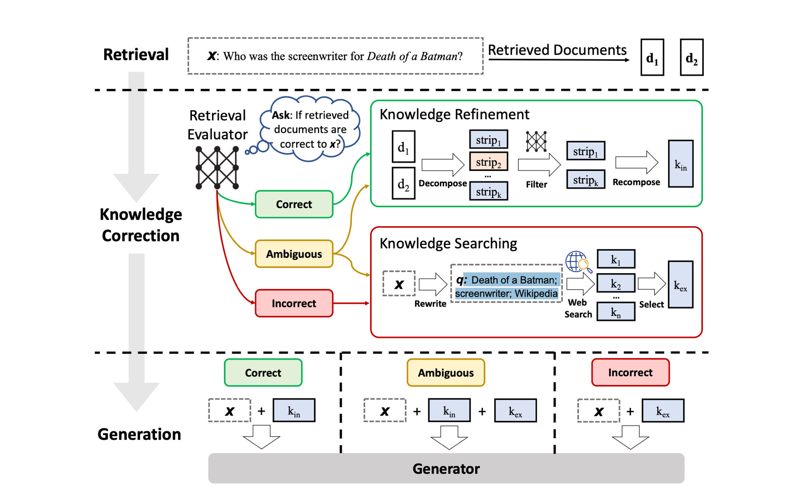
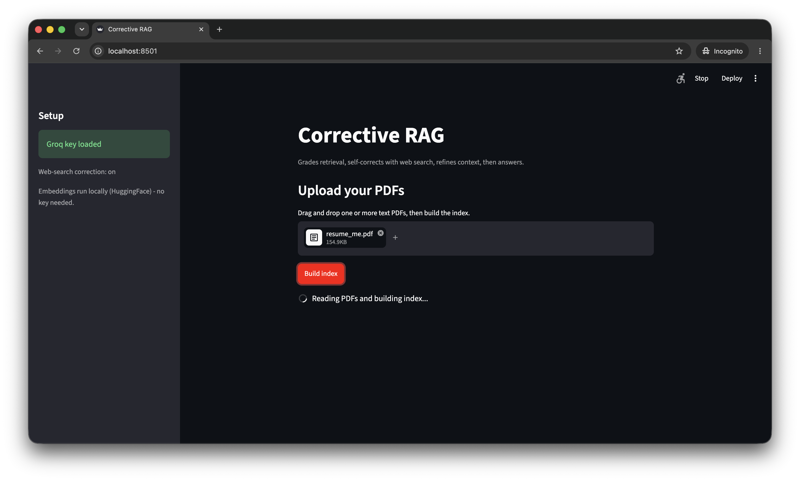
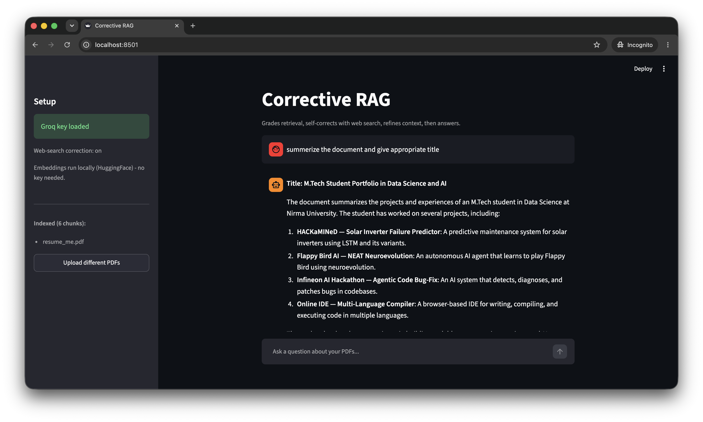
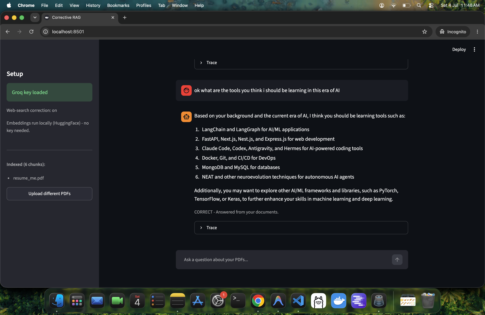

# Corrective RAG (CRAG) - PDF Q&A

A Streamlit app that lets you upload one or more text PDFs and ask questions about
them. Instead of blindly trusting whatever the retriever returns, it runs a
**Corrective RAG** pipeline: it grades each retrieved chunk, self-corrects with a
web search when the documents are weak or irrelevant, refines the context sentence
by sentence, and only then writes an answer.

The retrieval, grading, and correction logic is a port of `crag.ipynb`.

---

## What is Corrective RAG?

Plain Retrieval-Augmented Generation (RAG) retrieves the top-k chunks for a
question and feeds them straight to the LLM. If retrieval is wrong, the answer is
wrong - the model has no way to notice bad context.

**Corrective RAG** ([paper](https://arxiv.org/abs/2401.15884)) adds a
self-correction loop around retrieval:

1. **Retrieve** the top chunks.
2. **Grade** each chunk for relevance to the question.
3. **Decide** what the retrieval quality is:
   - **CORRECT** - at least one chunk is strongly relevant -> trust the documents.
   - **INCORRECT** - every chunk is irrelevant -> ignore documents, search the web.
   - **AMBIGUOUS** - somewhere in between -> use documents **and** web.
4. **Refine** the chosen context: break it into sentences and keep only the ones
   that actually help, dropping filler.
5. **Generate** the answer strictly from that refined context.

The result is an answer that is grounded in vetted context, and that can fall back
to fresh web information when your PDFs don't cover the question.

### Architecture



The diagram maps directly onto this app's pipeline:

- **Retrieval** - the question `x` retrieves candidate documents (`d1`, `d2`) - our
  `retrieve` node pulling the top-k chunks from FAISS.
- **Knowledge Correction** - a **Retrieval Evaluator** grades the documents and
  routes on the verdict:
  - **Correct** -> **Knowledge Refinement**: decompose the docs into strips
    (sentences), filter out the irrelevant ones, and recompose the internal
    knowledge `k_in`.
  - **Incorrect** -> **Knowledge Searching**: rewrite `x` into a web query, run a
    web search, and select external knowledge `k_ex`.
  - **Ambiguous** -> do **both** and combine `k_in` + `k_ex`.
- **Generation** - the generator writes the answer from `x` plus the knowledge it
  was given: `k_in` (Correct), `k_in + k_ex` (Ambiguous), or `k_ex` (Incorrect).

> Figure from the CRAG paper ([Yan et al., 2024](https://arxiv.org/abs/2401.15884)).

---

## Demo

### Home - upload your PDFs and build the index
Upload one or more PDFs directly on the home page, then click **Build index**.
The sidebar shows setup status (Groq key, web-search, local embeddings).



### Ask a question - answered from your documents
The model summarizes the uploaded document and answers from its content. Each reply
shows the CRAG verdict and a collapsible **Trace**.



### Follow-up - grounded, with the verdict shown
A follow-up question is answered from the documents. The `CORRECT - Answered from
your documents` note tells you the answer was grounded in your PDFs rather than the
web.



---

## How it works (pipeline)

```
retrieve -> grade each chunk -> route
     CORRECT              -> refine -> generate      (documents only)
     INCORRECT/AMBIGUOUS  -> rewrite query -> web search -> refine -> generate
```

The pipeline is built with **LangGraph** as a small state machine. Each box below
is a node in the graph:

| Node             | What it does                                                        |
|------------------|---------------------------------------------------------------------|
| `retrieve`       | Embeds the question and pulls the top 4 similar chunks from FAISS.   |
| `eval_each_doc`  | LLM scores each chunk 0.0-1.0 and sets the verdict (thresholds below).|
| `rewrite_query`  | Rewrites the question into a keyword web-search query.               |
| `web_search`     | Tavily web search (only on INCORRECT / AMBIGUOUS).                   |
| `refine`         | Splits context into sentences, keeps only the useful ones.          |
| `generate`       | Writes the final answer using only the refined context.             |

**Verdict thresholds** (from the notebook):
- **CORRECT** - at least one chunk scored `> 0.7`.
- **INCORRECT** - all chunks scored `< 0.3`.
- **AMBIGUOUS** - anything else.

**Context policy by verdict:**
- CORRECT -> documents only.
- INCORRECT -> web only.
- AMBIGUOUS -> documents + web.

> Note: the relevance grade is produced by the **LLM reading each chunk**, not by
> the embedding similarity score. Embeddings only decide which chunks show up;
> the LLM decides whether they are actually good.

---

## Tech stack

| Layer            | Choice                                    | Why                                        |
|------------------|-------------------------------------------|--------------------------------------------|
| Frontend / server| **Streamlit**                             | UI and Python backend in one process       |
| Orchestration    | **LangGraph** + **LangChain**             | Models the CRAG loop as a state graph      |
| LLM (chat)       | **Groq - Llama 3.3 70B** (`llama-3.3-70b-versatile`) | Free tier, fast, structured output |
| Embeddings       | **HuggingFace `all-MiniLM-L6-v2`** (local)| Free, runs locally, no API key             |
| Vector store     | **FAISS** (in-memory)                     | Fast similarity search over chunks         |
| PDF parsing      | **pypdf** via `PyPDFLoader`               | Extracts text from uploaded PDFs           |
| Web search       | **Tavily** (`langchain-tavily`)           | Corrective fallback for weak retrieval     |
| Config           | **python-dotenv**                         | Loads API keys from `.env`                 |

There is **no separate backend service**. Streamlit runs Python server-side, so the
whole graph (FAISS + Groq + Tavily) runs in the same process. Nothing else to deploy.

### Why these models?

The app originally used OpenAI (`gpt-4o-mini` + `text-embedding-3-large`). It now
defaults to a **free stack**: Groq for chat and a local HuggingFace model for
embeddings. The OpenAI code is kept, commented out, in `crag_engine.py` so you can
switch back by uncommenting the marked lines.

---

## Setup

**Prerequisites:** Python 3.10+, a free [Groq API key](https://console.groq.com),
and (optional) a [Tavily API key](https://tavily.com) for web-search correction.

```bash
python3 -m venv .venv && source .venv/bin/activate
pip install -r requirements.txt

cp .env.example .env      # then edit .env and add your keys
streamlit run app.py
```

Open http://localhost:8501, upload PDF(s), click **Build index**, and ask questions.

### Environment variables (`.env`)

```
GROQ_API_KEY=gsk_...      # required (chat)
TAVILY_API_KEY=tvly-...   # optional (enables web-search correction)
```

Embeddings run locally, so no embedding API key is needed. Without `TAVILY_API_KEY`,
the app still works but INCORRECT / AMBIGUOUS questions answer from documents alone
(or reply "I don't know.").

---

## Using the app

1. **Upload** one or more text PDFs on the home page.
2. Click **Build index** - the app extracts text, chunks it, embeds it locally, and
   builds a FAISS index (first run downloads the ~90MB embedding model once).
3. **Ask questions** in the chat box.
4. Under each answer:
   - a verdict line (`CORRECT` / `AMBIGUOUS` / `INCORRECT`) explains where the
     answer came from,
   - the **Trace** expander shows the reason, the web query (if any), and how many
     sentences survived refinement.
5. Use **Upload different PDFs** in the sidebar to start over with new documents.

---

## Project structure

```
C-RAG/
├── app.py             # Streamlit UI: upload, build index, chat
├── crag_engine.py     # build_index() + the compiled CRAG LangGraph
├── crag.ipynb         # original reference notebook
├── requirements.txt   # dependencies (free stack active)
├── .env.example       # API-key template
└── assets/            # screenshots used in this README
```

- **`crag_engine.py`**
  - `build_index(pdf_files)` - PDF bytes -> chunks -> local embeddings -> FAISS retriever.
  - `build_graph(retriever)` - compiles the LangGraph CRAG pipeline (all the nodes above).
  - `answer_question(graph, question)` - runs one question through the graph.
- **`app.py`** - thin Streamlit layer over the engine (upload, index, chat, trace).
